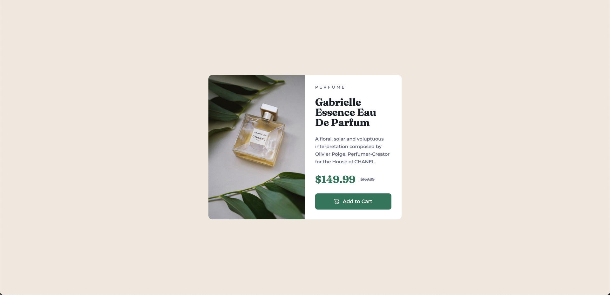
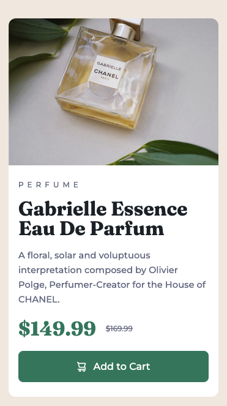

# Frontend Mentor - Product preview card component solution

This is a solution to the [Product preview card component challenge on Frontend Mentor](https://www.frontendmentor.io/challenges/product-preview-card-component-GO7UmttRfa).
這是 Frontend Mentor 上產品預覽卡片元件挑戰的解決方案。

## Table of contents 目錄

- [Overview 總覽](#overview-總覽)
  - [The challenge 挑戰內容](#the-challenge-挑戰內容)
  - [Screenshot 截圖](#screenshot-截圖)
  - [Links 連結](#links-連結)
- [My process 我的過程](#my-process-我的過程)
  - [Built with 使用技術](#built-with-使用技術)
  - [What I learned 學習心得](#what-i-learned-學習心得)
  - [Continued development 持續發展](#continued-development-持續發展)
- [Author 作者](#author-作者)

## Overview 總覽

### The challenge 挑戰內容

Users should be able to:
使用者應該能夠：

- View the optimal layout depending on their device's screen size
  根據設備螢幕大小查看最佳佈局
- See hover and focus states for interactive elements
  看到互動元素的懸停和焦點狀態

### Screenshot 截圖

Desktop view 桌面版視圖:


Mobile view 移動版視圖:


### Links 連結

- Solution URL: [https://github.com/ylin320/Product-preview-card-component]
- Live Site URL: [https://ylin320.github.io/Product-preview-card-component/]

## My process 我的過程

### Built with 使用技術

- Semantic HTML5 markup
- CSS custom properties
- Flexbox
- Mobile-first workflow

### What I learned 學習心得

This project was my first attempt at implementing a mobile-first approach. Here are some key learnings:

Using CSS custom properties for consistent theming:

```css
:root {
  /* Colors 顏色 */
  --color-green-500: hsl(158, 36%, 37%);
  --color-green-700: hsl(158, 42%, 18%);
  /* Typography 排版 */
  --font-family-montserrat: "Montserrat", sans-serif;
  --font-family-fraunces: "Fraunces", serif;
}
```

Implementing responsive images using the picture element:

```html
<picture class="card-image">
  <source
    srcset="./images/image-product-desktop.jpg"
    media="(min-width: 650px)"
  />
  
</picture>
```

Creating a responsive layout with flexbox:

```css
.card {
  display: flex;
  flex-direction: column;
}

@media only screen and (min-width: 650px) {
  .card {
    flex-direction: row;
  }
}
```

### Continued development 持續發展

In future projects, I want to focus on:
在未來的項目中，我想專注於：

- Implementing better accessibility features
  實現更好的無障礙功能
- Exploring CSS Grid for more complex layouts
  探索 CSS Grid 實現更複雜的佈局
- Optimizing performance with responsive images
  優化響應式圖片的性能
- Improving CSS organization and architecture
  改進 CSS 組織和架構
- Learning more about CSS animations and transitions
  學習更多關於 CSS 動畫和過渡效果

## Author 作者

- GitHub - [@ylin320](https://github.com/ylin320)
- Frontend Mentor - [@ylin320](https://www.frontendmentor.io/profile/ylin320)
